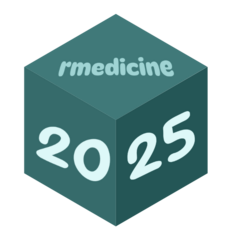

# rmedicine2025

# rmedicine2025 <a href="https://melissavanbussel.github.io/rmedicine2025/"></a>

<!-- badges: start -->
<!-- badges: end -->

The goal of rmedicine2025 is to ...

## Installation

You can install the development version of rmedicine2025 like so:

``` r
# FILL THIS IN! HOW CAN PEOPLE INSTALL YOUR DEV PACKAGE?
```

## Example

This is a basic example which shows you how to solve a common problem:

``` r
library(rmedicine2025)
## basic example code
```

